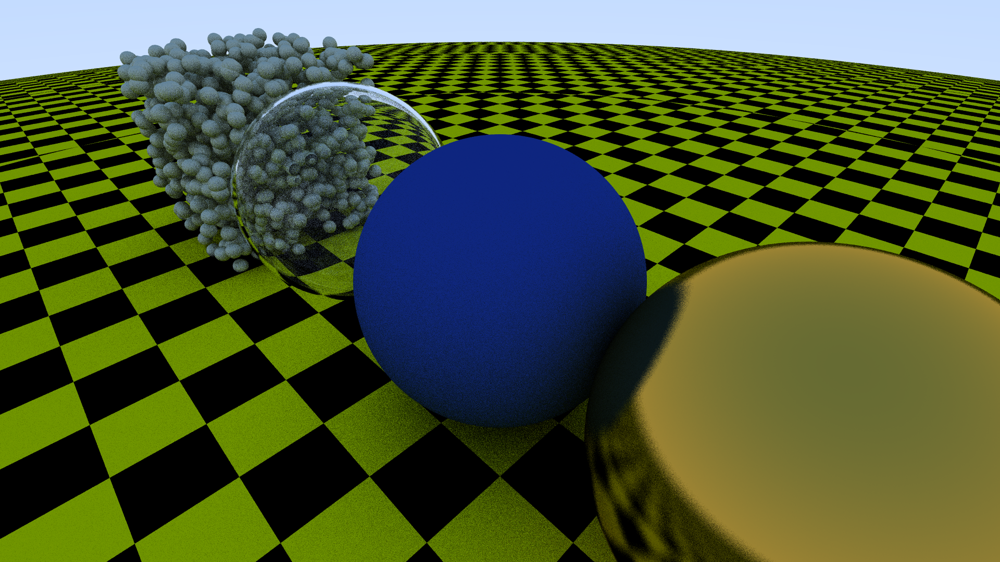

# Tracer++

A C++ ray tracer to be used as a test bench for ray-tracing experiments before implementing in TracerGL.



It outputs renders directly to a `.png` file.

## Build
Requires `SCons`

To Build,
```bash
$ scons
```

To Run
```bash
$ ./tracer.out [-r <WIDTH> <HEIGHT>] [-s NUM_SAMPLES]
```